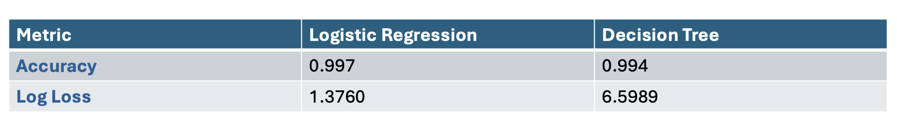
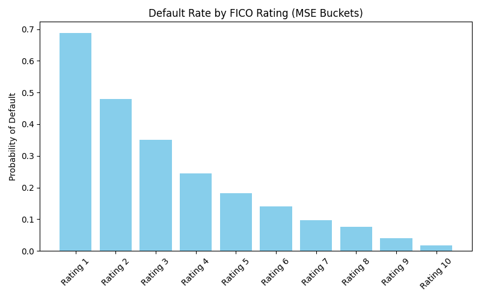

# JPMorganQuantResearchSimulation

## Forage JP Morgan Quant Research Simulation

The goal of this project was to develop a model that estimates the Probability of Default (PD) for individual loan applicants based on their financial profile. Using this estimate, we compute the Expected Loss assuming a 90% Loss Given Default (LGD) and using the loan amount outstanding as the Exposure at Default (EAD).

### The dataset contains features such as:
  • Number of credit lines outstanding
  
  • Loan amount outstanding
  
  • Total debt outstanding
  
  • Income
  
  • Years employed
  
  • FICO score
  
  • And a target variable: default (binary: 0 = no default, 1 = default)

## Implementations

### • Logistic Regression
Standardized all input features.
Used batch gradient descent to train logistic regression from scratch.
Output is a continuous estimate of the probability of default.

### • Decision Tree 
Built using binary splits based on Gini impurity.
Max depth: 4
Minimum samples per split: 5
Outputs PD as the average default rate at the terminal leaf node.

## Performance Comparison

• Logistic regression achieved slightly higher accuracy and significantly lower log loss, indicating better probabilistic predictions.

• Decision tree performed competitively but gave harder PD estimates due to its piecewise constant nature.

## FICO Score Quantization – MSE-Based Bucketing

For Task 4, I implemented a quantization method to convert raw FICO credit scores into categorical risk ratings. This was required for machine learning models that handle only categorical inputs, and is also useful for risk reporting and provisioning.

We applied mean squared error (MSE) minimization quantization to divide the continuous FICO score range (300–850) into 10 risk buckets.

This shows the probability of default (PD) in each bucket. As expected:

• Lower FICO ratings (e.g., Rating 1–3) have higher default rates.

• Higher FICO ratings (e.g., Rating 8–10) show significantly lower default risk.

This validates the assumption that FICO scores are a strong predictor of mortgage default risk, and confirms the effectiveness of our bucketing approach.

